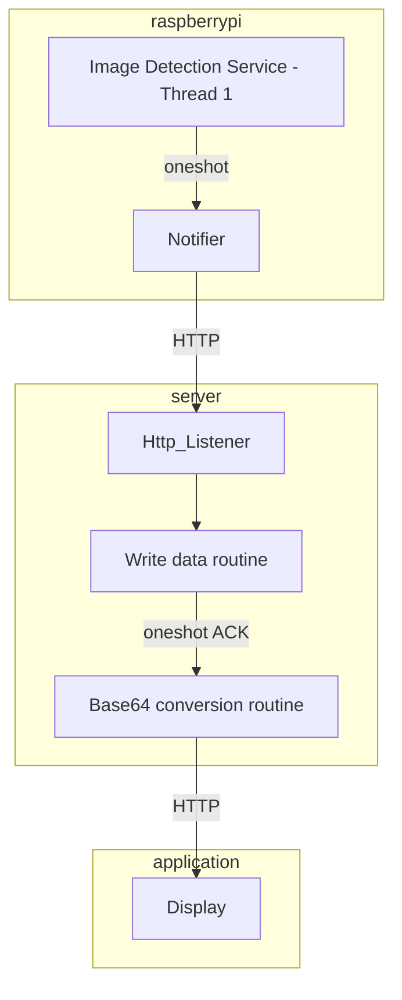

# System Architecture

## Components
The full system is made of three components: A computer node responsible for the image capturing routine; A web server that stores incoming images and a mobile application that displays them: 

